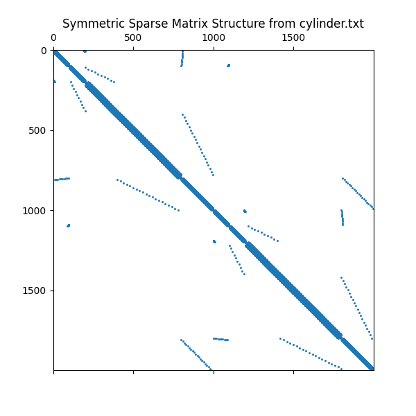

# Conjugate Gradient Solver for sparse symmetric matrices 

<!--  -->
<p align="center">

</p>

Run CG (x86) using a sample [problem](https://www.openfoam.com/documentation/tutorial-guide/2-incompressible-flow/2.2-flow-around-a-cylinder) from OpenFOAM:

```text
make test_cg
./build/test_cg  
```

Run vectorized CG in [Spyke](https://github.com/riscv-software-src/riscv-isa-sim) RISC-V simulator:
```
make run_test_cg_vec
```

Supported matrix formats: 
```text
- [x] COO
- [x] CSR
- [x] ELL 
- [] SELL
```

Vectorized kernels ([src/vectorized.c](src/vectorized.c) ): 
- Matrix Vector product (ELL)
- Dot product 
- SAXPY


```text
conjugate_gradient/
├── include/        # Header files (.h)
│   ├── cg.h, coo.h, csr.h, ...
├── src/            # algorithm and matrix formats support (.c)
│   ├── cg.c, coo.c, csr.c, ...
├── tests/          
│   ├── tests_cg.c, test_matrix.c, ...  # tests (.c)
├── build/          # Executables 
├── data/           # OpenFoam i/o files
├── riscv/          # Riscv simulated experimets (Spike)
├── Makefile        
└── README.md       
```